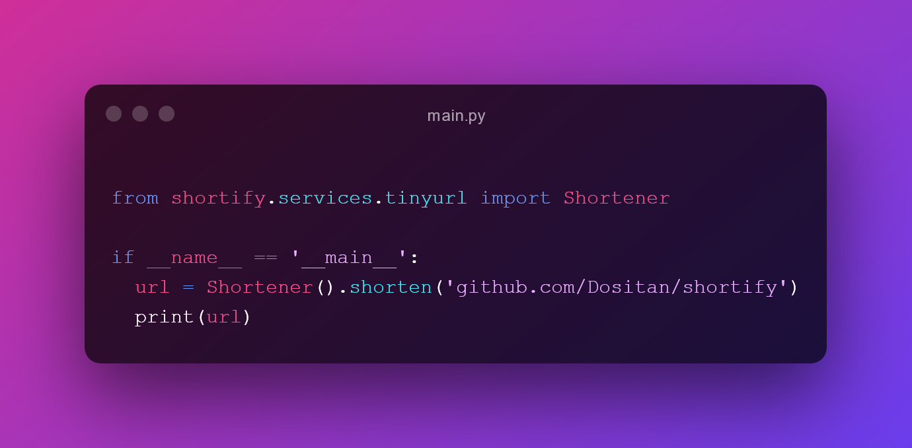

<div align="center">
    <h1>Shortify - shorten your URL.</h1>
    <p>~ A simple URL-shortening library with CLI support.</p>
</div>

<div align="center">
    <a href="https://shortify.readthedocs.io/en/latest">
        
    </a>
    <a href="https://shortify.readthedocs.io/en/latest">
        
    </a>
</div>

## Why to use?
**Simplicity.** Shortify's library is really easy to use and you can keep your code as shorter as you want.



-----

## Supported services
1. [TinyURL](https://tinyurl.com)
2. [Git.io](https://git.io)
3. [Shrtco.de](https://shrtco.de)
4. [Is.gd](https://is.gd)
5. [Clck.ru](https://clck.ru)
6. [TinyUID.com](https://tinyuid.com)
7. [CleanURI.com](https://cleanuri.com)

-----

## Installing
```console
$ pip install shortify
---> 100%
```

After pressing enter, pip will install all the required packages for the project.

-----

## CLI usage
Like all CLIs, `shortify` supports `--help` flag.
```console
$ shortify --help
usage: shortify [-h] {tinyurl,git,shrtcode,isgd,clck,tinyuid,cleanuri} url

Shortify CLI!

.....
```

Generating a shortened URL using git.io:
```console
$ shortify git https://www.github.com/Dositan/Boribay/
https://git.io/JBsPu
```
